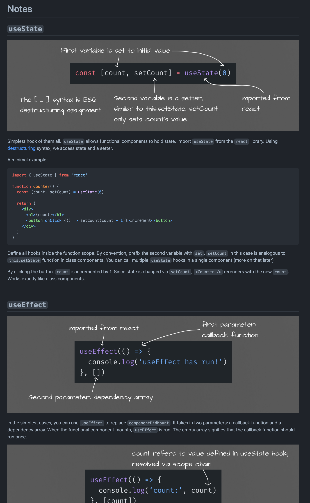

# React Hooks Workshop

December, 2021

Teaching Fellows: [@Danny Lahamar](https://www.linkedin.com/in/daniellahamar/), [@Savion Sweeney](https://linkedin.com/in/savion-sweeney), [@Sey Kim](https://linkedin.com/in/sey-kim)

**Youtube**: 1 [▶️](https://www.youtube.com/watch?v=mkvhikFmA5c) | 2 [▶️](https://www.youtube.com/watch?v=PUPKNlwsMbM&t=0s)

This repository is divided into two directories: `01` and `02`. Simply `cd 01/ (or 02/) && npm start`. Check out the [first](./01-NOTES.md) and [second](./02-NOTES.md) lecture notes.

## Topics

- Refactoring class components to functional components
- Demo of individual hooks: `useState`, `useEffect`, `useReducer`, `useContext`
- Using hooks with `redux-react` and `react-router`
- Walkthrough of a fullstack boiler plate app, and live refactoring
- Building your own hooks: implement dark mode!

## Workshop 

### Pedagogy

Brainstorming for the workshop was done with FigJam. We prepared slides, and carefully considered which projects to live refactor, and which concepts to showcase individually.

Students were given notes to pre-read as well as follow along the lectures. This helped especially with the live demo.

## Connect with us:

